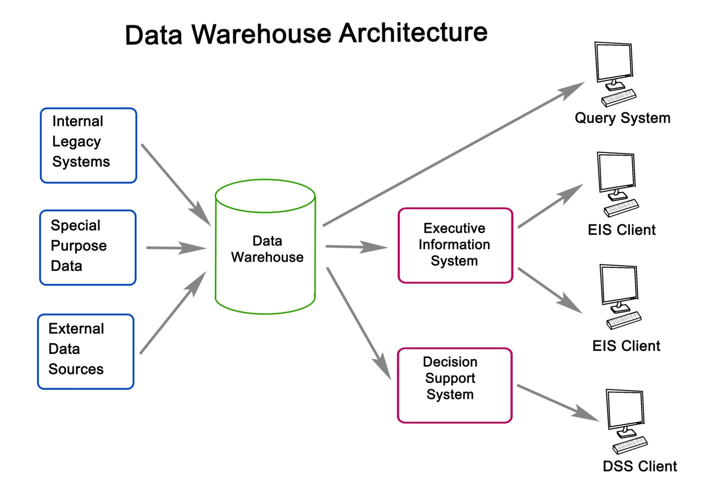

<div align="center">

# 👁️ BlinkLink

### Hands-Free IoT Control via Facial Recognition & Eye Blinks

**Empowering Independence Through Assistive Technology**

[](https://opensource.org/licenses/MIT)
[](https://www.python.org/downloads/)
[](https://opencv.org/)
[](https://www.tensorflow.org/)
[](https://mqtt.org/)

[Features](#-key-features) • [Demo](#-demo) • [How It Works](#-how-it-works) • [Installation](#-installation) • [Usage](#-usage) • [Contributing](#-contributing)

</div>

---

## 🎯 What is BlinkLink?

BlinkLink is an **innovative assistive technology system** designed to help individuals with severe motor disabilities control their environment using **only facial gestures**. By combining cutting-edge **Computer Vision**, **Machine Learning**, and **IoT technology**, BlinkLink transforms simple eye blinks into powerful commands that can control smart home devices, computers, and more.

### The Problem We're Solving

Millions of people worldwide live with conditions like ALS, cerebral palsy, or spinal cord injuries that severely limit their motor control. Traditional assistive devices often require complex setup, expensive hardware, or invasive procedures. **BlinkLink offers a non-invasive, affordable, and easy-to-use alternative** that only requires a standard webcam.

---

## 🌟 Key Features

<table>
<tr>
<td width="50%">

### 🔐 Biometric Security

- **Facial Recognition** ensures only authorized users can access the system
- Custom-trained TensorFlow model for accurate identification
- Privacy-focused: All processing happens locally on your device

</td>
<td width="50%">

### 👁️ Real-Time Blink Detection

- Ultra-responsive detection using **Dlib's 68-point facial landmarks**
- **Eye Aspect Ratio (EAR) algorithm** for accurate blink recognition
- Configurable sensitivity and thresholds

</td>
</tr>
<tr>
<td width="50%">

### 🌐 Wireless IoT Control

- Lightweight **MQTT protocol** for instant device communication
- Control virtually any electronic appliance via **ESP32**
- Expandable to multiple devices and rooms

</td>
<td width="50%">

### 🧩 Modular Architecture

- Clean, **object-oriented Python codebase**
- Easy to maintain, extend, and customize
- Separate modules for authentication and gesture detection

</td>
</tr>
</table>

---

## 🎬 Demo

<div align="center">

<!--  -->

_Watch BlinkLink in action: The system authenticates the user's face (green box), then responds to deliberate eye blinks to toggle an IoT device._

</div>

### What You'll See:

1. **Face Detection**: System identifies and tracks your face
2. **Authentication**: Facial recognition verifies your identity
3. **Authorization**: Green box indicates you're cleared to control devices
4. **Blink Command**: Simple eye blink triggers IoT device (light/fan/etc.)

---

## 🔬 How It Works

<div align="center">



</div>

### The Journey of a Blink

```
👤 User Blinks → 📹 Webcam Captures → 🧠 AI Processes → 📡 MQTT Publishes → 💡 Device Responds
```

1. **Vision Controller (Python/PC)** 🖥️

   - Captures video feed from webcam
   - Performs facial recognition for authentication
   - Detects eye blinks using computer vision
   - Publishes commands via MQTT protocol

2. **MQTT Broker (Cloud/Local)** ☁️

   - Acts as central message hub (e.g., HiveMQ, Mosquitto)
   - Receives commands from Vision Controller
   - Routes messages to appropriate IoT devices

3. **IoT Device (ESP32)** 🔌
   - Subscribes to MQTT topics
   - Receives wireless commands
   - Controls physical relay to switch devices
   - Provides feedback via serial monitor

---

## 🛠️ Technology Stack

<div align="center">

|      Category      | Technologies                                                                                                                                                                                                                                                                                                                                                    |
| :----------------: | :-------------------------------------------------------------------------------------------------------------------------------------------------------------------------------------------------------------------------------------------------------------------------------------------------------------------------------------------------------------- |
|  **AI & Vision**   |     |
| **IoT & Hardware** |                                                                                                                                                                                                                                                                    |
| **Communication**  |                                                                                                                                                                                                               |
|  **Development**   |                                                             |

</div>

---

## 🚀 Installation

### Prerequisites

**Hardware:**

- 📹 Standard USB Webcam
- 🔧 ESP32 DevKit V1 Board
- ⚡ 5V Relay Module
- 🔌 USB Cable & Jumper Wires

**Software:**

- 🐍 Python 3.9 or higher
- 🔧 Arduino IDE 1.8.13+
- 💻 Windows/Linux/macOS

### Step 1: Clone the Repository

```bash
git clone https://github.com/assidik12/BlinkLink.git
cd BlinkLink
```

### Step 2: Set Up Vision Controller (Python)

1. **Install Python dependencies:**

   ```bash
   pip install -r requirements.txt
   ```

2. **Download Dlib's facial landmark model:**

   - [Download here](http://dlib.net/files/shape_predictor_68_face_landmarks.dat.bz2)
   - Extract and place `shape_predictor_68_face_landmarks.dat` in the `vision_controller/` directory.

3. **Collect and Encode Your Face Data:**

   - Run the following command and follow the on-screen instructions to capture and encode your face data:

   ```bash
   python vision_controller/collect_and_encode.py
   ```

### Step 3: Set Up IoT Device (ESP32)

1. **Install ESP32 Board in Arduino IDE:**

   - Follow this [guide](https://randomnerdtutorials.com/installing-the-esp32-board-in-arduino-ide/) to add ESP32 support to your Arduino IDE.

2. **Install Required Libraries:**

   - Open Arduino IDE, go to `Sketch > Include Library > Manage Libraries...`
   - Search for and install the following libraries:
     - `PubSubClient` by Nick O'Leary
     - `WiFi` (usually pre-installed with ESP32 board package)

3. **Configure and Upload Code:**
   - Open `iot_device/iot_device.ino` in Arduino IDE.
   - Update Wi-Fi credentials in the code:
     ```cpp
     const char* ssid = "YOUR_SSID";
     const char* password = "YOUR_PASSWORD";
     ```
   - Connect your ESP32 board, select the correct board (`ESP32 Dev Module`) and port in Arduino IDE.
   - Upload the code to the ESP32.

---

## ▶️ Usage

1. **Start the Vision Controller:**

   ```bash
   python main.py
   ```

2. **Monitor Output:**

   - Watch the terminal for logs on face detection, authentication, and device control.

3. **Interact with IoT Devices:**
   - Use configured eye blink gestures to control connected IoT devices (e.g., turn on lights, fans).

---

## 🤝 Contributing

We welcome contributions to BlinkLink! Please follow these steps:

1. **Fork the repository**
2. **Create a new branch**: `git checkout -b feature/YourFeature`
3. **Make your changes**
4. **Commit your changes**: `git commit -m 'Add some feature'`
5. **Push to the branch**: `git push origin feature/YourFeature`
6. **Open a Pull Request**

Please ensure your code follows the existing style and includes appropriate tests.

---

## 📄 License

This project is licensed under the MIT License - see the [LICENSE](LICENSE) file for details.

---

## 📞 Contact

For questions or feedback, please reach out:

- **Your Name** - [sofi.sidik12@gmail.com](mailto:sofi.sidik12@gmail.com)
- **LinkedIn:** [https://www.linkedin.com/in/ahmad-sofi-sidik/](https://www.linkedin.com/in/ahmad-sofi-sidik/)

---

Thank you for your interest in BlinkLink! Together, let's make technology accessible to everyone.
